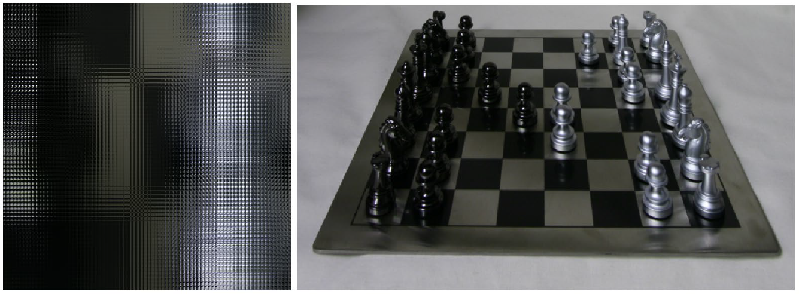
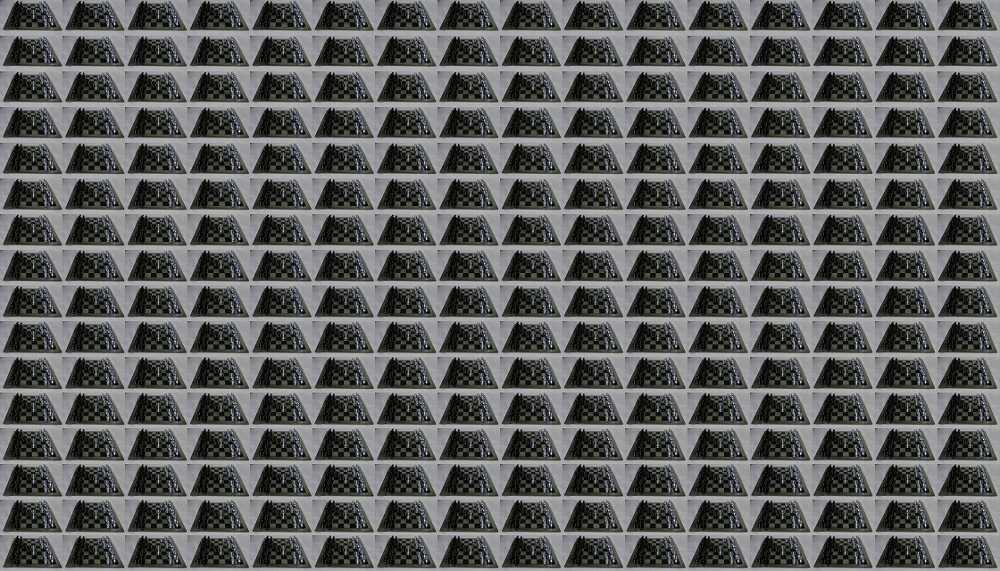

## Assignment 5

### Light Field Rendering, Focal Stacks, and Deph from Defocus

<p align='center'>
  
  <figcaption>Fig 1. The chessboard scene light_eld. Left: Crop of the light_eld image. Right: A pinhole camera view of the scene. </figcaption>
</p>

#### Initials

```matlab
img = imread('chessboard_lightfield.png');
[h,w,c] = size(img);
u = 16;
v = 16; 
s = h/u;
t = w/v;

lightfield = zeros(u, v, s, t, c);
for i = 1:s
    for j = 1:t
        for x = 1:u
            for y = 1:v
                for z = 1:c
                    lightfield(x,y,i,j,z) = double(img((i-1)*u+x, (j-1)*v+y, z))/256;
                end
            end
        end
    end
end
```

#### Sub-aperture views


```matlab
mosaic = zeros(h, w, c);
for i = 1:u
    for j = 1:v
        mosaic((i-1)*s+1:(i-1)*s+s, (j-1)*t+1:(j-1)*t+t, :) = lightfield(i, j, :, :, :);
    end
end
```

<p align='center'>
  
  <figcaption>Fig 2. Mosaic of sub-aperture views. </figcaption>
</p>

#### Refocusing and focal-stack generation

```matlab
depth = {};
for d = 0:0.2:2
    combine = zeros(s, t, c);
    for i = 1:s
        for j = 1:t
            sum = 0;
            for x = 1-u/2:u/2
                for y = 1-v/2:v/2
                    i_ = round(i + x * d);
                    j_ = round(j - y * d);
                    if i_<=s && i_>=1 && j_<=t && j_>=1
                        for z = 1:c
                            combine(i, j, z) = combine(i, j, z) + lightfield(x+u/2, y+v/2, i_, j_, z);
                        end
                        sum = sum + 1;
                    end
                end
            end
            combine(i, j, :) = combine(i, j, :) / sum;
        end
    end
    imwrite(combine, strcat('img_depth_',num2str(d),'.png'));
    depth{end + 1} = combine;
end
```

#### All-focus image and depth from defocus

```matlab
for d = 1:11
    luminance{end + 1} = rgb2xyz(depth{d}, 'ColorSpace', 'srgb');
    luminance{end} = luminance{end}(:, :, 2);
    low{end + 1} = imgaussfilt(luminance{end}, 2.5);
    % Get high frequency
    high{end + 1} = luminance{end} - low{end};
    % Get sharpness
    sharpness{end + 1} = imgaussfilt(high{end} .^ 2, 4);
end
```

```matlab
all_focus = zeros(s, t, c);
depth_gray = zeros(s, t);
 for x = 1:s
     for y = 1:t
        w = 0;
        for d = 1:11
            for z = 1:c
                all_focus(x, y, z) = all_focus(x, y, z) + depth{d}(x, y, z) * sharpness{d}(x, y);
            end
            depth_gray(x, y) = depth_gray(x, y) + d * sharpness{d}(x, y);
            w = w + sharpness{d}(x, y);
        end
        all_focus(x, y, :) = all_focus(x, y, :) / w;
        depth_gray(x, y) = depth_gray(x, y) / w;
     end
 end
```
